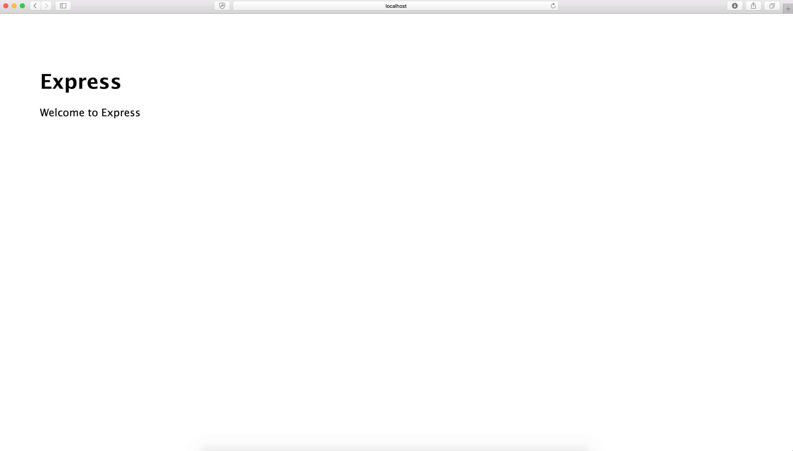
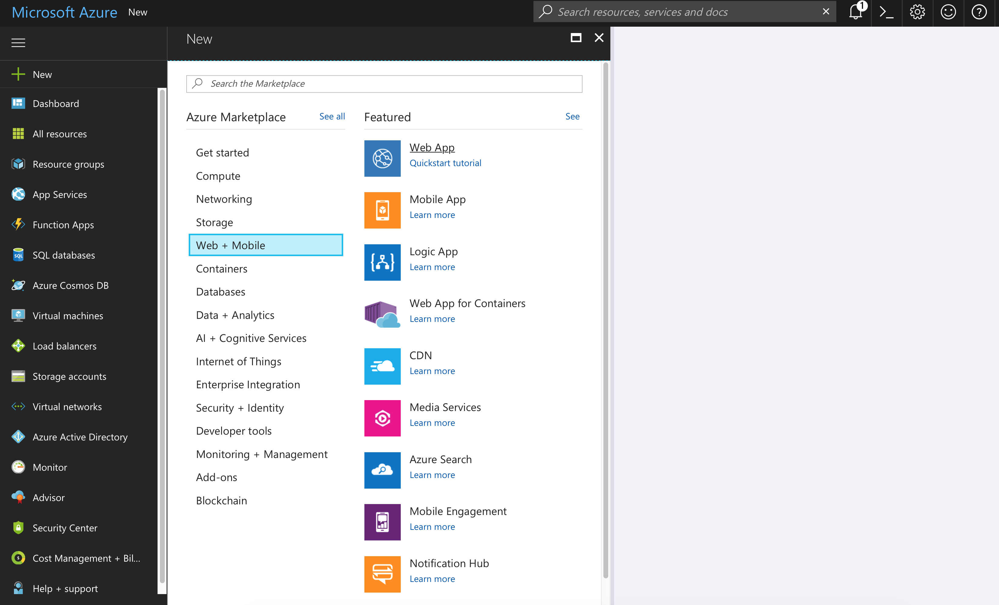
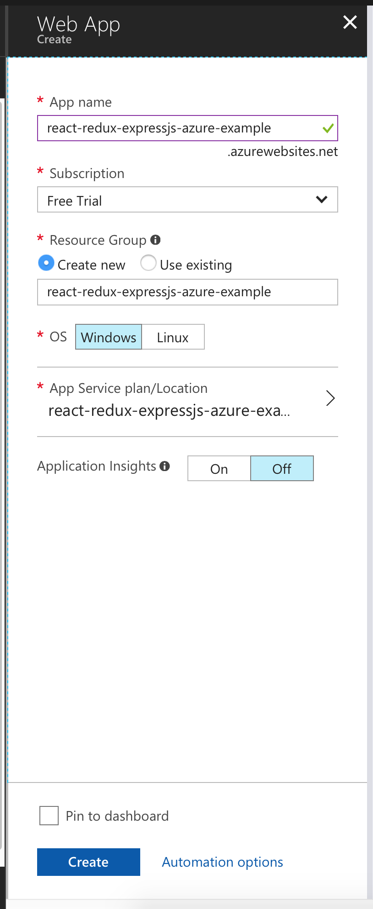
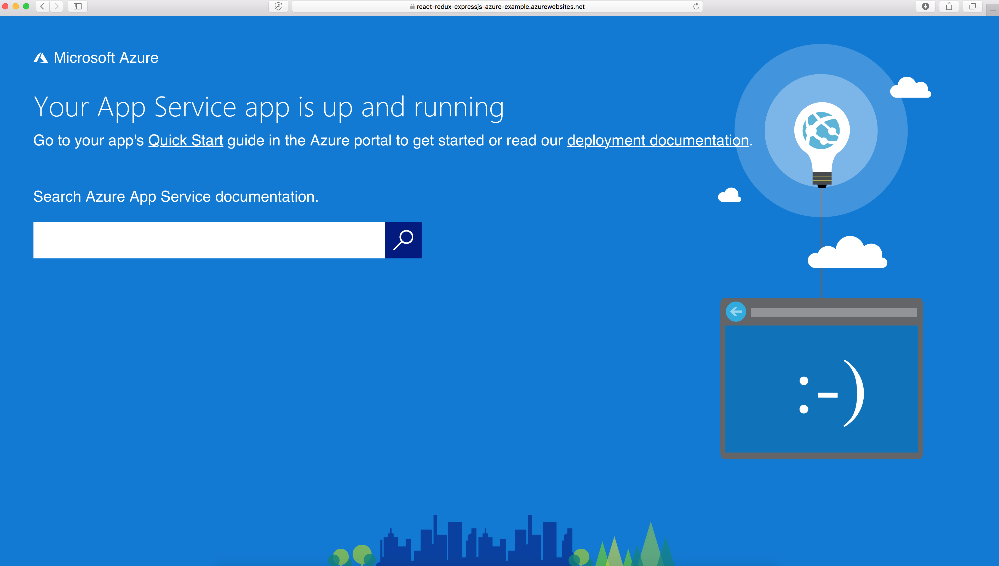
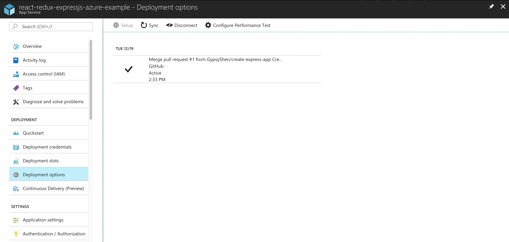
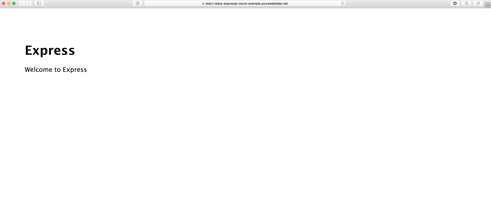
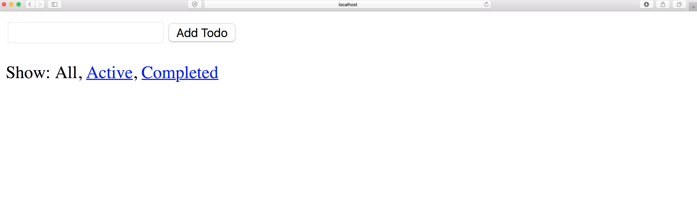
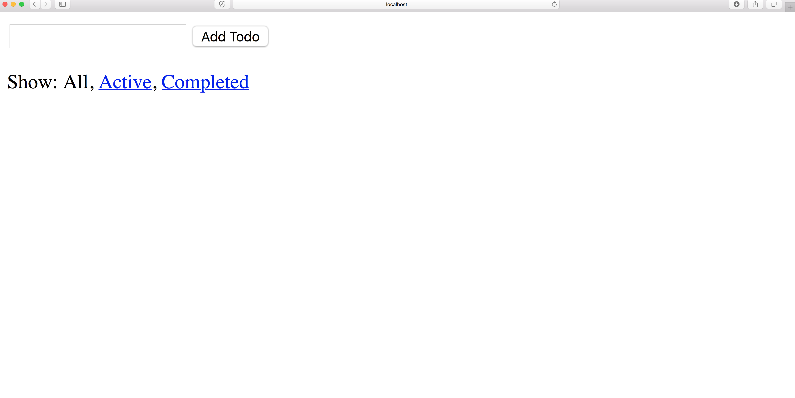
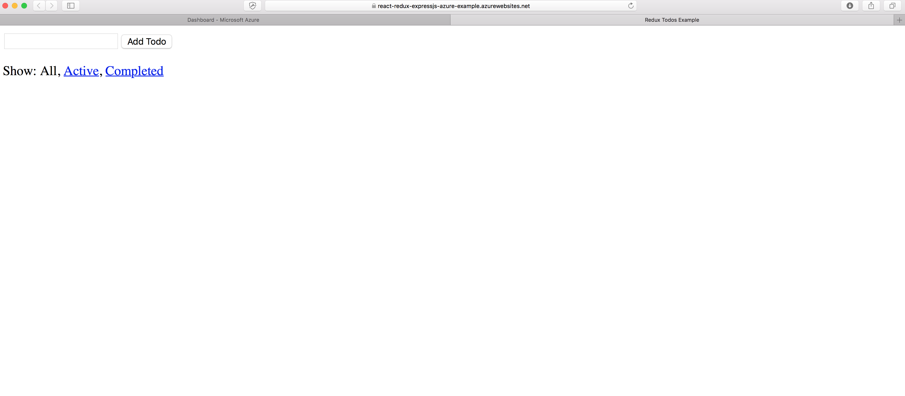

# react-redux-expressjs-azure-example
A Todos web app built with ReactJS and Redux as frontend, served by expressJS as backend, and deployed to Microsoft Azure Web App service by GitHub. The web app is live on Microsoft Azure:

https://react-redux-expressjs-azure-example.azurewebsites.net

## Table of Contents

* [Create the Express App](#create-the-express-app)
* [Deploy the Express App in Azure](#deploy-the-express-app-in-azure)
* [Add the React and Redux Todos App to the Express App](#add-the-react-and-redux-todos-app-to-the-express-app)
* [Automate the Deployment in Azure](#automate-the-deployment-in-azure)
* [Reference](#reference)

## Create the Express App

* [Step 1: install the express-generator utility](#step-1-install-the-express-generator-2-utility)
* [Step 2: create the Express app](#step-2-create-the-express-app)
* [Step 3: move react-backend files to root folder](#step-3-move-react-backend-files-to-root-folder)
* [Step 4: run the Express app locally](#step-4-run-the-express-app-locally)

_NOTE: this section is referenced from [[1]](#1-create-react-app-with-an-express-backend)._

#### Step 1: install the express-generator [[2]](#2-express-application-generator) utility

```
$ npm install -g express-generator
```

#### Step 2: create the Express app

In the root folder of the project, run:

```
$ express react-backend
```

The command generates two items to the root folder:

```
LICENSE
react-backend/
```

#### Step 3: move react-backend files to root folder

Moving react-backend files to the root folder makes it simpler to host the web app in Azure, because Azure would directly take express app files in root folder of the project and connect it to its hosting service. But it is doable to not moving the files and configure project files in Azure for deployment.

Now the root folder should contain the following items:

```
app.js
bin/
LICENSE
package.json
public/
routes/
views/
```

#### Step 4: run the Express app locally

In root folder:

First, install the modules by the following command:

```
npm install
```

Second, run the app by the following command:

```
PORT=3001 node bin/www
```

Third, browse the Express app in localhost 3001:

```
http://localhost:3001
```
<p align="center">
  
</p>

## Deploy the Express App in Azure

* [Step 1: browse Microsoft Azure Portal and sign in](#step-1-browse-microsoft-azure-portal-and-sign-in)
* [Step 2: create an new web app in Azure](#step-2-create-an-new-web-app-in-azure)
* [Step 3: deploy the express app to azure](#step-3-deploy-the-express-app-to-azure)

_NOTE: this sesson is referenced from [[3]](#3-create-a-nodejs-web-app-in-azure)_

#### Step 1: browse Microsoft Azure Portal and sign in

```
https://portal.azure.com/
```

#### Step 2: create an new web app in Azure

In the dashboard of Azure Portal, create an new web app in the following steps:

```
New > Web + Mobile > Web App
```
<p align="center">
  
</p>

Fill in the web app details, including:

```
App name
Subscription
Resource Group
OS
App Service plan/Location
Application Insights
```
<p align="center">
  
</p>

Then, hit the create button to create the web app.

Wait for a little bit, then referesh the browser, the web app `react-redux-expressjs-azure-example` appears in the dashboard as App Service. Clicking on `react-redux-expressjs-azure-example` App Service brings up details of the azure app, from where the hosted app can be browsed by `Overview > Browse` with an url of `https://react-redux-expressjs-azure-example.azurewebsites.net`:

<p align="center">
  
</p>

#### Step 3: deploy the express app to azure

Deployment is done by configuring the deployment options with github repo:

```
DEPLOYMENT > Deployment options > Choose Source > GitHub > Choose project and Choose branch > OK
```

Then, the express web app in GitHub shows up in the `Deployment options` screen and building. Once the building is passed, which looks like:

<p align="center">
  
</p>

Browse the azure app, it should show the express app in `https://react-redux-expressjs-azure-example.azurewebsites.net`:

<p align="center">
  
</p>

After this step, any change in the `master` branch triggers a new deployment in Azure.

## Add the React and Redux Todos App to the Express App

* [Step 1: create redux todos app](#step-1-create-redux-todos-app)
* [Step 2: serve the redux todos app by the express app](#step-2-serve-the-redux-todos-app-by-the-express-app)

#### Step 1: create redux todos app

First, create a `client` folder in the root folder to host the redux code.

Then, add the Redux Todos Example [[4]](#4-redux-todos-example) to the `client` rolder.

Then, add modules for the redux todos app. In root folder:

```
cd client
npm install
```

Browse the redux todos app:

```
npm start
```

Type `http://localhost:3000` in local browser, the redux todos app shows up:

<p align="center">
  
</p>

#### Step 2: serve the redux todos app by the express app

The react and redux todos app is serverd by pointing the express app's frontend to the production build of the react and redux app.

First, build the react and redux app with the following command in the `client` directory, which generates a `build/` folder:

```
npm run build
```

Then, configure `app.js` in the root folder to serve the react and redux app by replacing line 23 (`app.use(express.static(path.join(__dirname, 'public')));`) with:

```
app.use(express.static(path.join(__dirname, './client/build')));
```

Now the react and redux app should show up in the express port. To test it, in the root directory, run the express app in port `2048`:

```
PORT=2048 node bin/www
```

Then browse the express app in `http://localhost:2048`, the react and redux todos app shows up:

<p align="center">
  
</p>

Finally, committing all the changes to `master` branch should deploy the react and redux app in Azure!

<p align="center">
  
</p>

## Automate the Deployment in Azure

* [Step 1: install Azure Web App Deployment Script Generator](#step-1-install-azure-web-app-deployment-script-generator)
* [Step 2: generate `.deployment` and `deploy.sh` in root directory](#step-2-generate-deployment-and-deploysh-in-root-directory)
* [Step 3: configure `deploy.sh` to generate the production build of redux todos app](#step-3-configure-deploysh-to-generate-the-production-build-of-redux-todos-app)

If you've noticed, we have to manually commit the production build of the redux app to see changes of the todos app in Azure. That's very inconvenient. The good news is that azure deployment is configurable in scripts. This means that we can configure the deployment scripts of azure to automatically generate the production build of the redux app before it's deployed. However, it took me a while to figure out the reliable way to do it.

Some blog posts suggest downloading the `deployment.cmd` file from the azure project configuration portal, configure it, and place it to the root directory. Then azure would run the configured `deployment.cmd` file for deployment. Some blog posts says from the azure project configuration portal, we can download a zip file containing two files: `.deployment` and `deployment.cmd`, but I wasn't able to download a zip file. Instead, I can only download the `deployment.cmd`, and when I configured and added it to the root directory, the script is never executed on azure deployment.

After some effort, I found out that using Azure Web App Deployment Script Generator [[5]](#5-azure-web-app-deployment-script-generator) works:

#### Step 1: install Azure Web App Deployment Script Generator

```
npm install azure-cli -g
```

#### Step 2: generate `.deployment` and `deploy.sh` in root directory

```
azure site deploymentscript --node
```

If you see an error says `error: 'site' is not an azure command. See 'azure help'.`, try to change azure-cli's mode to 'asm' [[6]](#6-error-site-is-not-an-azure-command-see-azure-help):

```
azure config mode asm
azure site -h
```

#### Step 3: configure `deploy.sh` to generate the production build of redux todos app

Generating the production build of the react and redux app requires two steps [[7]](#7-my-first-experience-with-react-nodejs-and-azure):

```
generate the modules
generate the proudction build with the build command of `react-scripts.cmd` in the generated modules
```

Here is the configuration in `deploy.sh` of the two steps:

```
# 4. Install client libraries
if [ -e "$DEPLOYMENT_TARGET/client/package.json" ]; then
  cd "$DEPLOYMENT_TARGET/client"
  eval $NPM_CMD install
  exitWithMessageOnError "npm failed"
  cd - > /dev/null
fi

# 5. Build react & redux client
if [ -e "$DEPLOYMENT_TARGET/client/node_modules/.bin/react-scripts.cmd" ]; then
  cd "$DEPLOYMENT_TARGET/client"
  ./node_modules/.bin/react-scripts build
  exitWithMessageOnError "npm failed"
  cd - > /dev/null
fi
```

Add the above code snippet after the code of `# 3. Install npm packages` (line 112) after line 118.

Now we can remove the build folder of the client and commit all changes. Then push the change to GitHub, Azure would use the configured script for deployment. We could verify that the Azure uses the configured script by checking the modules of the react and redux todos app in Azure Configuration Portal of the app:

```
https://react-redux-expressjs-azure-example.scm.azurewebsites.net > Debug console > CMD > site > wwwroot > client
```

If you see the `npm_modules/` and `build/` folders, it means azure uses the configured script because the default script doesn't generate modules for the redux app in `client` folder. It only generates modules for the express app because that's contained in the default deployment script.

An alternative way to verify is:

```
https://react-redux-expressjs-azure-example.scm.azurewebsites.net > Debug console > CMD > site > deployments > (select a deployment) > log.log
```

Edit the `log.log` file, you should find `Running custom deployment command...,`.

## Reference

#### [1] [Create React App with an Express Backend](https://daveceddia.com/create-react-app-express-backend/)

#### [2] [Express Application Generator](https://expressjs.com/en/starter/generator.html)

#### [3] [Create a Node.js web app in Azure](https://docs.microsoft.com/en-us/azure/app-service/app-service-web-get-started-nodejs)

#### [4] [Redux Todos example](https://github.com/reactjs/redux/tree/master/examples/todos)

#### [5] [Azure Web App Deployment Script Generator](https://github.com/projectkudu/kudu/wiki/Deployment-hooks#deployment-script-generator)

#### [6] [error: 'site' is not an azure command. See 'azure help'](https://social.msdn.microsoft.com/Forums/azure/en-US/8459d5d1-63fb-44ae-8608-9cb0da79a560/error-site-is-not-an-azure-command-see-azure-help)

#### [7] [My first experience with React, NodeJS and Azure](https://dev.to/manny42/my-first-experience-with-react-nodejs-and-azure)
